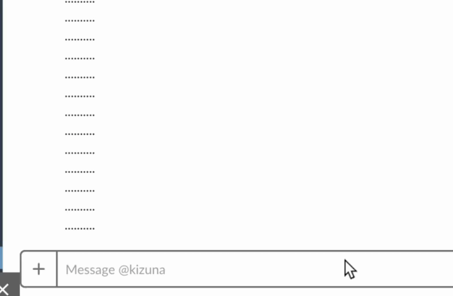
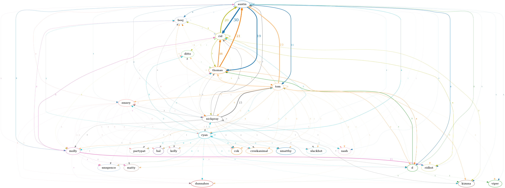

# カオリ

[](https://github.com/austinpray/kaori/actions?query=workflow%3ACI)
[](https://codecov.io/gh/austinpray/kaori)

Hi there! I am a slack bot with functionality that ranges from "useless" to "pretty neat".

## [Plugins](kaori/plugins)

My features are implemented as plugins. They can be enabled, disabled, featured flagged independently.

### [`ping`](kaori/plugins/ping.py)

My "hello world" plugin. If you say "ping", I'll say "pong".

### [Gacha card game](kaori/plugins/gacha)

Create, collect, battle gacha cards.

### [Kkreds](kaori/plugins/kkreds)

A virtual slack currency.

### [`clap ...`](kaori/plugins/clap.py)

This :clap: is :clap: probably :clap: the :clap: most :clap: obnoxious :clap: plugin.

`kaori clap --help` for more options.

### utility plugins

- [User management](kaori/plugins/users)

<!--
## Features

### Mentions Graph

I can draw a directed graph of the mentions between all the people in your
slack. The vertices are people and the edges are the the mentions between two
people. The weight a particular edge represents how many times the head vertex
has mentioned the tail vertex.



Example graph:


-->

## Development

I'm kinda easy to get running. Development and production deployment is all
done with Docker. Make sure you have Docker installed and running on your
system.

The most difficult part of this whole thing is literally just filling in the
environment variables. Please PR this document or the `.env.example` file to
make this easier for people who come after you.

### Run me

1. You should probably create your own bot testbed slack if you don't already
   have one. <https://slack.com/create>
1. [Create a slack app](https://api.slack.com/apps) and deploy it to your testbed slack
1. You need create a `.env` file with all the necessary values. Easiest way to
   do this is to `cp .env.example .env` and then replace the bogus values with
   real values.
1. Run `make` to build all the containers
1. `docker-compose run --rm worker alembic upgrade head` will create the
   database for you
1. `docker-compose up` will start me up! My web interface runs at
   [http://localhost:8000]() and my API runs at [http://localhost:8001]()


We aren't out of the woods yet. Now we have to let slack make requests to our API.

1. Install [ngrok][] or do something that will allow you to expose your local
   API endpoint to the internet.
2. Go to [Your Apps](https://api.slack.com/apps) and under your bot under
   "Event Subscriptions" enter your api url. The path should be:
   `/slack/events`
3. If you are using [ngrok][] you can inspect the requests from slack at
   [http://127.0.0.1:4040]()

NOW you should be up and running.

### Development / Debug mode

If you want:

- Your code to automatically reload when changed
- Debugger friendly settings (long timeouts, no concurrency)

```
docker-compose -f docker-compose.yml -f dev.docker-compose.yml up
```

Note that this deviates from production quite a bit. You should still test PRs using the non-debug docker-compose.

You can easily set a debugger breakpoint now.

```
docker ps
# look for your desired container ID
docker attach $YOUR_CONTAINER_ID
```

Set breakpoints in your file.

```python
breakpoint()
```

You should get a pdb shell in your attached TTY. Exit your attached shell with 
`CTRL-p CTRL-q`.
[More info on `docker attach`](https://docs.docker.com/engine/reference/commandline/attach/).
Note that if you are running docker-compose from IntelliJ it has a nice GUI for attaching a shell to a running container without having to copy IDs around and such.

### Tests

Test coverage is reported to [Codecov](https://codecov.io/gh/austinpray/kaori).


To run the tests:

```bash
make test
```

or

```bash
docker-compose run test
```

If you want an interactive shell to run tests in:

```bash
docker-compose run test sh -l
```

[ngrok]: https://ngrok.com/

