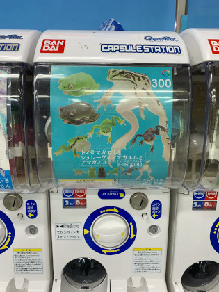
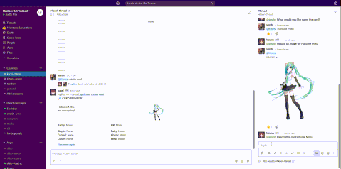
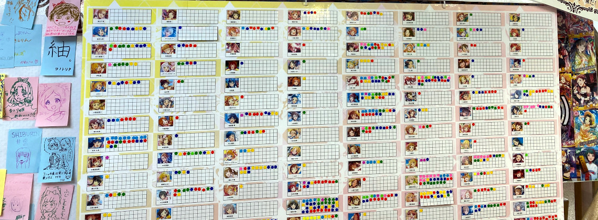
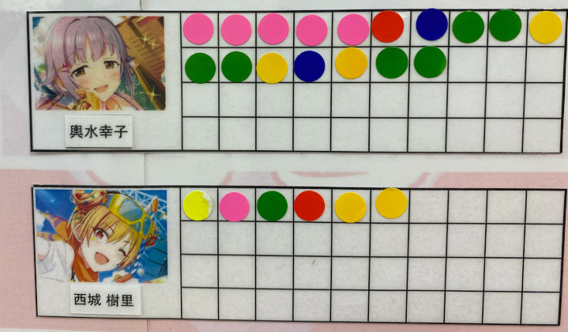

    
    <h1>Gacha Card Game</h1>
    

        <b>create, collect, battle gacha cards.</b>
    

    

        <a href="#core-features">core features</a>
        |
        <a href="#card-guide">card guide</a>
    

     
     

## Core features

### Create cards

> 

Create a card for your waifu, favorite meme, whatever you think is topical.
You assign a rarity and a nature for your card which [determines the battle stats](#nature-x-stat-interactions).

### Roll for random cards in the global pool

> 

Creating a card will add a copy of it to your personal collection.
The card will also be placed in the global pool of cards available for random acquisition through rolling.

### Battle other people and their cards

> 

May the best waifu win.

## Card Guide

### Card Rarities

| rarity | budget | split |
|--------|--------|-------|
| S      | 20     | 6/6   |
| A      | 20     | 5/5   |
| B      | 19     | 4/4   |
| C      | 16     | 3/3   |
| F      | 10     | 2/2   |

### Nature x Stat interactions:

| nature / stat | HP | EVA | AMR | DMG | CRT | SPD |
|--------------------------|----|-----|-----|-----|-----|-----|
| Stupid                   | ➕  |     |     |     |     | ➖  |
| Baby                     | ➖  | ➕   |     |     |     |    |
| Clown                    |    | ➖   | ➕   |     |     |    |
| Horny                    |    |     | ➖   | ➕   |     |    |
| Cursed                   |    |     |     | ➖   | ➕   |    |
| Feral                    |    |     |     |     | ➖   | ➕  |
